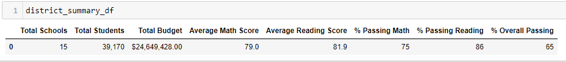
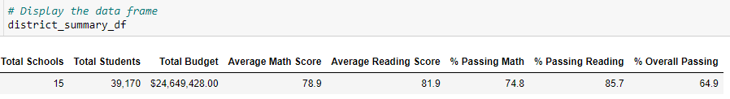
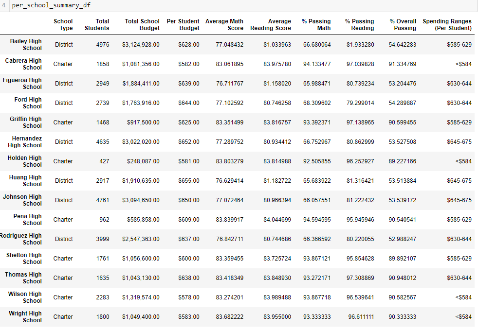
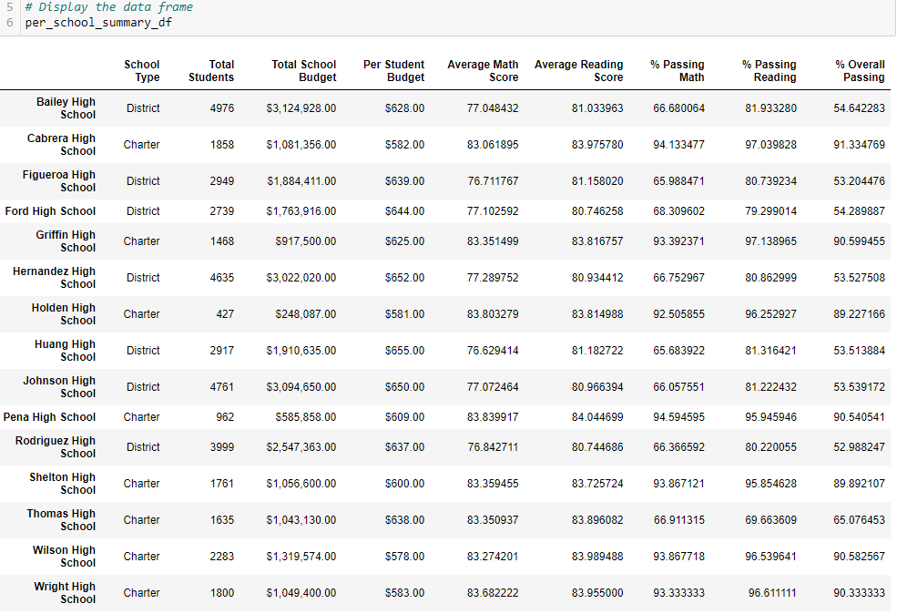

# School_District_Analysis

## Overview
It was evidence of academic dishonesty with the math and reading grades for the ninth graders for Thomas High School.  The purpose of this analysis was to replace the math and reading scores for Thomas High school with NaNs while leaving the other data unchanged.  A repeat analysis was completed once the ninth graders from Thomas High School grades were "removed".

## Results of the Analysis

* How is the district summary affected?

    Initial Analysis

    

    Second Analysis

    

* How is the school summary affected?

    Initial Analysis

    

    Second Analysis

    

